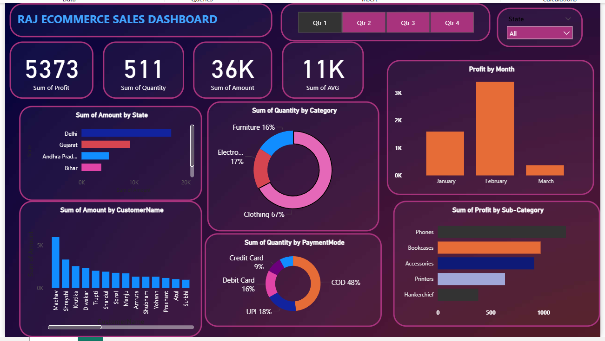

## Ecommerce Sales Dashboard (Power BI)

## Project Overview

This project presents an interactive Ecommerce Sales Dashboard created using Power BI.
The dashboard analyzes sales performance, customer purchasing behavior, and profit trends to help understand business performance and key revenue drivers.

## Tools Used

- Power BI
- Microsoft Excel
- Data Visualization

## Dataset

The dataset contains ecommerce order information including:

- Order ID
- Customer Name
- State
- Category & Sub-Category
- Payment Mode
- Quantity
- Sales Amount
- Profit

## Dashboard Metrics

The dashboard provides the following key metrics:

- Total Profit: 5373
- Total Quantity Sold: 511
- Total Sales Amount: 36K
- Average Sales Value: 11K

## Key Insights

- Clothing category contributes the highest share (67%) of total quantity sold.
- COD (Cash on Delivery) is the most used payment method (48%).
- Delhi generates the highest sales among all states.
- February recorded the highest monthly profit.
- Phones and Bookcases generate the highest profit among product sub-categories.

## Dashboard Preview

## Project Outcome

This project demonstrates how Power BI can transform raw ecommerce data into meaningful business insights using interactive visualizations and dashboards.

## Author

Pavitra Patil
Aspiring Data Analyst | Skilled in Power BI, Excel & Data Visualization
